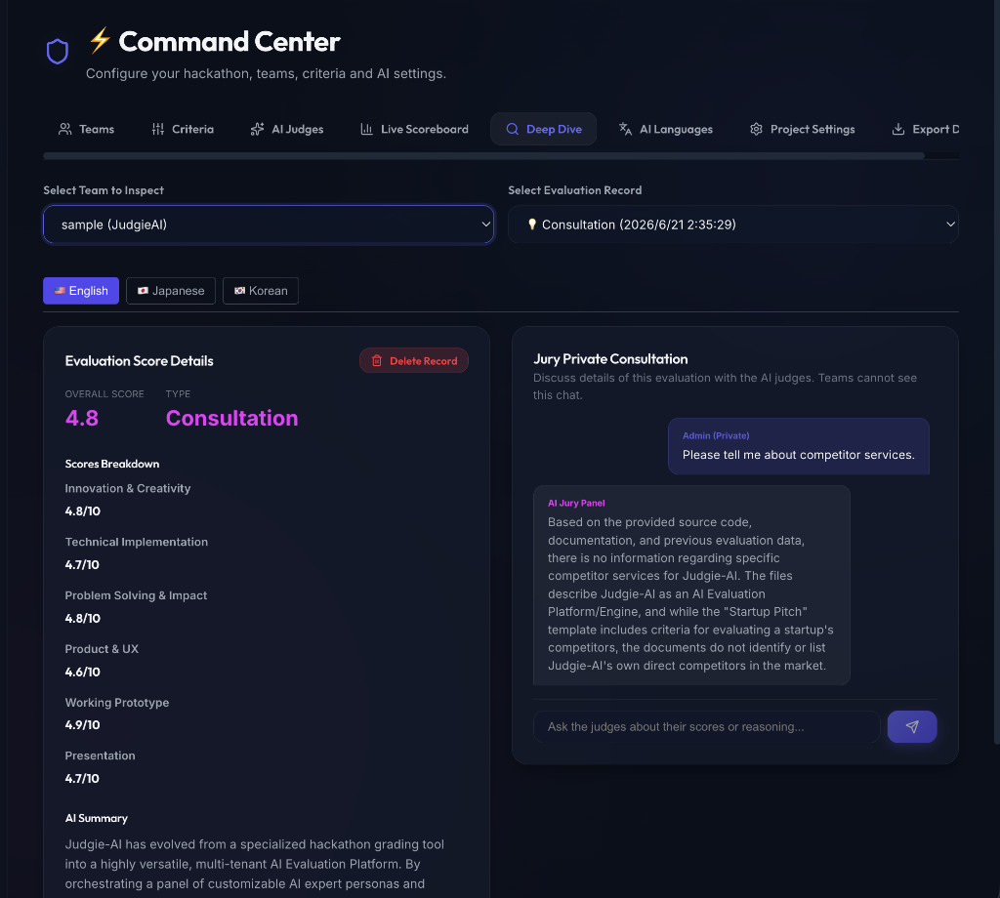

# ⚖️ Judgie-AI

<p align="center">
  
</p>

<p align="center">
  
  
  <a href="https://railway.com/deploy/judgieai"></a>
  <a href="https://github.com/sponsors/yosuke1024"></a>
</p>

**Judgie-AI** is an **AI Evaluation Platform** that automates and enhances the judging, feedback, and coaching process for various workflows (including Hackathons, Startup Pitches, Hiring Evaluations, and Software Architecture Reviews). Leveraging Google Gemini's multimodal capabilities, it evaluates submissions (source code ZIPs, demo videos, PDF slides, resumes) from the diverse perspectives of a customizable panel of AI expert personas, providing actionable coaching, scoring, and multi-turn Q&A dialogue.

> 💡 **Judgie-AI** is part of the **[PixApps](https://pixapps.ai/)** suite — a collection of innovative, AI-powered applications. Explore our other projects and support our work at [pixapps.ai](https://pixapps.ai/).

<p align="center">
  
</p>

<details>
  <summary>📸 More Screenshots (Click to expand)</summary>
  <br>
  <table align="center">
    <tr>
      <td><b>AI Feedback & Evaluation</b></td>
      <td><b>The Hype Board (Rankings)</b></td>
    </tr>
    <tr>
      <td></td>
      <td></td>
    </tr>
    <tr>
      <td><b>Rules & Persona Panel</b></td>
      <td><b>Command Center (Admin Consultation)</b></td>
    </tr>
    <tr>
      <td></td>
      <td></td>
    </tr>
  </table>
</details>

---

## 📖 Origin & Evolution

**Judgie-AI** was born out of a very personal, practical need. 

I was asked to judge an internal company hackathon that had to be conducted in English. As someone who isn't comfortable with English, the thought of evaluating dozens of English-language submissions was incredibly daunting. I needed a way to survive the judging process and make it more efficient. So, I built a tool to automate the first pass of evaluation by orchestrating a panel of AI expert personas (like UX designers, VCs, and engineers) to review code, videos, and slides.


But while developing it, I realized something exciting: **the core engine I was building was far more powerful and versatile than just a hackathon helper.** 

A framework that coordinates multiple expert AI personas, evaluates multimodal inputs against customizable rubrics, and conducts multi-turn contextual Q&A is actually a **universal AI Evaluation Engine**. 

Whether it's auditing software system architectures, screening startup pitches, running technical interviews, or reviewing product proposals, Judgie-AI has evolved into a general-purpose **AI Evaluation Platform**. Hackathons are now just one template among many.

### 📝 Blog Posts
- 🇯🇵 [ハッカソンの審査員が、ハッカソンをハックした話](https://moneyforward-dev.jp/entry/2026/07/01/171847) - Money Forward Developers Blog
- 🇬🇧 [How a Hackathon Judge Hacked the Hackathon](https://global.moneyforward-dev.jp/2026/07/02/how-a-hackathon-judge-hacked-the-hackathon/) - Money Forward Developers Blog (Global)

---

## ✨ Core Features

1. **🏢 Role-based Access Control & Administration**
   - Admins can manage global configurations, database state, and system-level setups.
   - A dedicated **Members Management Panel** allows admins to view all users, search, reset passwords, change roles (admin/team/observer), and assign teams dynamically.
   - Admins can manage accounts, including bulk import via CSV (supporting username column), password resets, and settings.
   - The entire instance operates in a secure environment with role-based access control (Admin, Team, Observer).
2. **⚖️ Evaluation Template Packs & Custom Imports**
   - Spin up new projects instantly with built-in templates: **Hackathon Evaluation**, **Startup Pitch Review**, **Hiring & Technical Interview**, and **Software Architecture Review**.
   - Create and reuse custom template JSON files directly from GitHub Raw URLs or other Web endpoints to run your own custom rubrics and expert panel.
3. **🧑‍⚖️ Customizable AI Persona Panel**
   - Define custom "Criteria" (Rubrics) and "Personas" (AI Judges) for each project.
   - Multiple AI judges review submissions from distinct professional angles (e.g., UX Designer, VC, Principal Engineer, Security SRE).
   - Support custom avatar images (Base64 encoding) or emojis for each judge.
4. **🔄 Behavioral Context Settings & Iterative Coaching**
   - Configure whether the AI panel reviews revisions **cumulatively** (retaining previous feedback to assess improvement, ideal for hackathons) or **independently** (evaluating each submission freshly from scratch, ideal for hiring and recruiting workflows).
   - Visualize score histories and progress deltas on the team dashboard.
5. **💬 Multi-turn Objection / Q&A Dialogue**
   - Teams can ask questions or object to the AI's evaluation.
   - Supports **multi-turn chat threads** with AI judges up to a configured turn limit (e.g., 3 turns, 5 turns, or unlimited). The AI panel references the full conversation history to maintain context.
6. **💬 Admin Submission Chat**
   - Project admins can directly chat with the AI panel about a submission (e.g., "What libraries are they using?", "Identify potential security issues").
7. **🌐 Bilingual UI**
   - Seamless English/Japanese switching. AI feedback and summaries are generated in both languages simultaneously.
8. **👤 Username Login Support**
   - Log in using either email or username, improving usability and flexibility for offline or local password authentication.

## 🚀 Tech Stack

- **Frontend**: React (TypeScript), Vite, TailwindCSS & Vanilla CSS
- **Backend**: FastAPI (Python)
- **Database**: SQLite3 / PostgreSQL (Cloud SQL)
- **AI Core**: Google Gemini API (**Recommended** - Supports dynamic model selection: `gemini-3.5-flash`, `gemini-3.1-pro`, etc.) - Crucial for large context handling (Code ZIPs, PDFs) and native video evaluation via the Gemini File API.

---

## 🛠️ Creating Custom Template Packs

You can define your own evaluation templates in JSON format and import them when creating a new project. 

### Custom Template Format (JSON)
The JSON file must conform to the following schema:

```json
{
  "name": "Template Name",
  "description": "Short description of this evaluation template.",
  "re_evaluation_context_mode": "independent", // "cumulative" (hackathon revision check) or "independent" (fresh evaluation)
  "max_qa_turns": 3, // Number of Q&A exchanges allowed (-1 for unlimited, 0 to disable)
  "criteria": [
    {
      "name": "Criteria Name (e.g. Code Quality)",
      "weight": 25, // Percentage weight (total should ideally sum to 100)
      "description": "Detailed prompt instructing the AI on what to evaluate and signals of a strong submission."
    }
  ],
  "personas": [
    {
      "id": "1",
      "name": "Judge Name",
      "role": "Judge Professional Role",
      "avatar": "🛡️", // Emoji representation
      "active": true,
      "prompt": "Detailed system instructions outlining this judge's persona background, expertise, tone of voice, and scoring preferences."
    }
  ]
}
```

### Hosting & Importing Templates
1. Upload your template JSON file to a public web server, GitHub repository, or GitHub Gist.
2. Get the **Raw URL** of the JSON file (e.g., `https://raw.githubusercontent.com/username/repo/main/my-template.json`).
3. In the **Admin Command Center**, choose **Custom (Import from URL)** under "Evaluation Template".
4. Paste the Raw URL and click **Create Project**. Judgie-AI will fetch the configuration and set up your project automatically.

---

## 📦 Getting Started & Deployment

### 1. Deploying to Railway (Recommended - One-Click Deploy)

The fastest and easiest way to deploy Judgie-AI is using **Railway**. With zero configuration needed, it automatically builds the React frontend, provisions the FastAPI backend container, and sets up your choice of PostgreSQL database or SQLite with replication.

[](https://railway.com/deploy/judgieai)

#### Configuration During Deployment
You will be prompted to set the following environment variables. The SQLite database or PostgreSQL connection is configured automatically:
- `DEFAULT_ADMIN_ID`: The login ID for your Admin dashboard. (Default: `admin`)
- `DEFAULT_ADMIN_PASSCODE`: The password for your Admin account. (Default: `admin123`)
- `ALLOWED_IPS`: (Optional) Comma-separated list of allowed IP addresses or subnets. If empty, IP restriction is disabled.

---

### 2. Local Development Setup
Clone the repository:
```bash
git clone https://github.com/yosuke1024/Judgie-AI.git
cd Judgie
```

#### Option A: Docker Compose (Easiest)
You can launch the entire stack (both backend and frontend) using Docker Compose.

1. **Configure Environment Variables**:
   Copy `.env.example` to `.env` and fill in your details (such as `GEMINI_API_KEY` for AI evaluations to function):
   ```bash
   cp .env.example .env
   ```
2. **Start the Stack**:
   ```bash
   docker compose up --build
   ```
3. **Access the App**:
   Open `http://localhost:8080` in your browser.
     - Log in as the default admin: **Email:** `admin@example.com`, **Password:** `admin123` (configured in `docker-compose.yml`).

> [!NOTE]
> Since this method builds the production assets for the React frontend to serve them through FastAPI, frontend changes will not hot-reload (HMR). If you edit the frontend code, you must rebuild the container using `docker compose up --build`.

#### Option B: Bare Metal (Recommended for Frontend Active Development)

Setup and Run the Backend:
```bash
cd backend
python -m venv venv
source venv/bin/activate  # On Windows: venv\Scripts\activate
pip install -r requirements.txt
python -m uvicorn app.main:app --host 127.0.0.1 --port 8000 --reload
```

Setup and Run the Frontend:
```bash
cd ../frontend
npm install
npm run dev
```

Open `http://localhost:5173` in your browser.

Initial Login & Config:
Upon the first launch, a default `admin` account is created automatically.
- **Email**: `admin@example.com`
- **Password**: `admin123`

Log in using your administrator credentials. **Please change your password immediately after your first login.**

Once logged in:
1. Go to **⚙️ System Settings** -> **🤖 Gemini Configuration** tab.
2. Input and save your **Gemini API Key**. This will dynamically fetch and let you select the available Gemini models.

---

### 3. Self-Hosting on Cloud Providers (GCP, AWS, Azure, etc.)

For advanced enterprise environments or self-hosting on major cloud providers (AWS, GCP, Azure, etc.), Judgie-AI is fully containerized and can be run using the provided [Dockerfile](file:///Users/suzukiyousuke/repo/Judgie/Dockerfile).

#### 1. Build the Docker Image
Run the following command in the root directory to build the production container:
```bash
docker build -t judgie-ai:latest .
```

#### 2. Run the Container Locally
You can run the container by mapping the ports and passing the required environment variables:
```bash
docker run -d \
  -p 8080:8080 \
  -e DEFAULT_ADMIN_ID="admin" \
  -e DEFAULT_ADMIN_PASSCODE="admin123" \
  judgie-ai:latest
```

#### 3. Cloud Deployment
To host the container on services like **Google Cloud Run**, **AWS ECS (Fargate)**, or **Azure Container Apps**:
1. Push the built image to your container registry (e.g., Google Artifact Registry, Amazon ECR, Docker Hub).
2. Deploy the container with:
   - Port mapped to `8080` (or set the `PORT` environment variable).
   - The required environment variables configured (`GEMINI_API_KEY`, etc.).
   - Database Configuration: Specify the `DATABASE_URL` (e.g., `postgresql://...` for managed databases) to point to your persistent database.

---

## 📖 Usage & Guide

### Roles & Access
| Role | Example ID | Primary Responsibilities |
|---|---|---|
| **👑 Admin** | `admin` | Set evaluation criteria, manage settings/OIDC, manage personas, register teams, view the scoreboard. |
| **🧑‍💻 Team (Participant)** | (Issued by Admin) | Upload submissions, request AI coaching/evaluations, edit profiles, object/discuss with judges. |

### User Manuals
For detailed instructions on how to use the platform as a Team (Participant) or Admin, please refer to our bilingual user manuals:
- [📖 English User Manual](docs/user_manual_en.md)
- [📖 日本語 ユーザーマニュアル](docs/user_manual_ja.md)

---

## ⚙️ Configuration & Security

### Optional OIDC Gateway & Auto-Login Authentication (SSO)
For private or enterprise deployments, you can configure Judgie-AI to run in Single Sign-On (SSO) mode using OIDC (OpenID Connect / Google OAuth). 

When OIDC is enabled, **local password-based login is disabled for teams** (the initial administrator can still log in using local email/password login as a fallback). Users are authenticated via their OIDC identity provider, and are automatically logged into the application using their registered email address.

To enable OIDC authentication, configure the following variables in your `.env` file (or Cloud Run environment variables):
- `OIDC_ENABLED=true` (Set to `false` or omit to bypass OIDC and use normal password login)
- `OIDC_ISSUER=https://accounts.google.com` (Your OIDC identity provider issuer URL, defaults to Google)
- `OIDC_CLIENT_ID=your-client-id`
- `OIDC_CLIENT_SECRET=your-client-secret`
- `OIDC_REDIRECT_URI=http://localhost:5173/` (Your application's base URL in local development, or your production URL)
- `OIDC_ALLOWED_DOMAINS=yourcompany.com` (Comma-separated list of allowed email domains. Leave empty to allow any authenticated user)
- `OIDC_ALLOWED_EMAILS=admin@gmail.com` (Comma-separated list of allowed individual emails)
- `DEFAULT_ADMIN_EMAIL=organizer@company.com` (Optional: The email address of the initial Admin. Used during startup automatic provisioning in single-tenant deployments)

#### How it works:
1. **SSO Redirect:** When users visit the site, they are redirected to the OIDC provider (e.g., Google Sign-In) to authenticate.
2. **Auto-Login:** Once authenticated, Judgie-AI verifies the email against the `users` database table. If a match is found, the user is automatically logged in under their corresponding role (`admin`, `team`, `observer`) without any password prompts.
3. **Registration:** Admins must register participants' email addresses beforehand in the Admin Command Center (passwords are generated randomly behind the scenes). For initial setup, the initial admin email can be set via `DEFAULT_ADMIN_EMAIL` or designated during system seeding.
4. **Access Denied:** If an authenticated user's email is not registered in the database, access is blocked and an "Account Not Registered" error page is displayed.

* **Password Hashing:** Team and admin passwords are safely hashed using `bcrypt` before being stored in the database.
* **IP Firewall:** An optional IP-based firewall is supported via the `ALLOWED_IPS` environment variable (comma-separated IP addresses) to restrict platform access.

---

## 🛠️ Development & Contributing

### Directory Structure
```
├── .github/              # GitHub Actions workflows & PR templates
├── backend/              # FastAPI Backend Server
│   ├── app/              # Application modules (auth, models, routers, schemas, services)
│   ├── data/             # Database storage (judgie.db)
│   ├── tests/            # Python backend tests
│   └── requirements.txt  # Python package requirements
├── frontend/             # React Frontend Client (Vite + TypeScript)
│   ├── src/              # Source files (api, contexts, pages, components, locales)
│   ├── public/           # Static assets
│   └── package.json      # Node package requirements
├── docs/                 # Documentation (testing guide, user manuals)
└── assets/               # Repository assets (screenshots and logo)
```

### Technical Notes
- The SQLite database (`judgie.db`) is automatically created in the `backend/data/` directory upon backend execution.
- Session Management: Authentication and credentials are managed using secure session cookies, eliminating complex URL parameters.
- Dev Mode Auto-reload: Hot-reloading is supported out-of-the-box for both backend (Uvicorn `--reload`) and frontend (Vite HMR).

### Testing
Judgie-AI features a comprehensive test suite. For details on how to run tests locally and verify code coverage, please refer to [docs/testing.md](docs/testing.md).

### Contributing
We welcome contributions from the community! Please read our [CONTRIBUTING.md](CONTRIBUTING.md) to learn how to get started, set up your development environment, and submit pull requests.

---

## 💖 Sponsors

If you find Judgie-AI helpful and want to support its active development, please consider sponsoring this project!

- [GitHub Sponsors](https://github.com/sponsors/yosuke1024)

---

## License

This project is licensed under the MIT License - see the [LICENSE](LICENSE) file for details.
