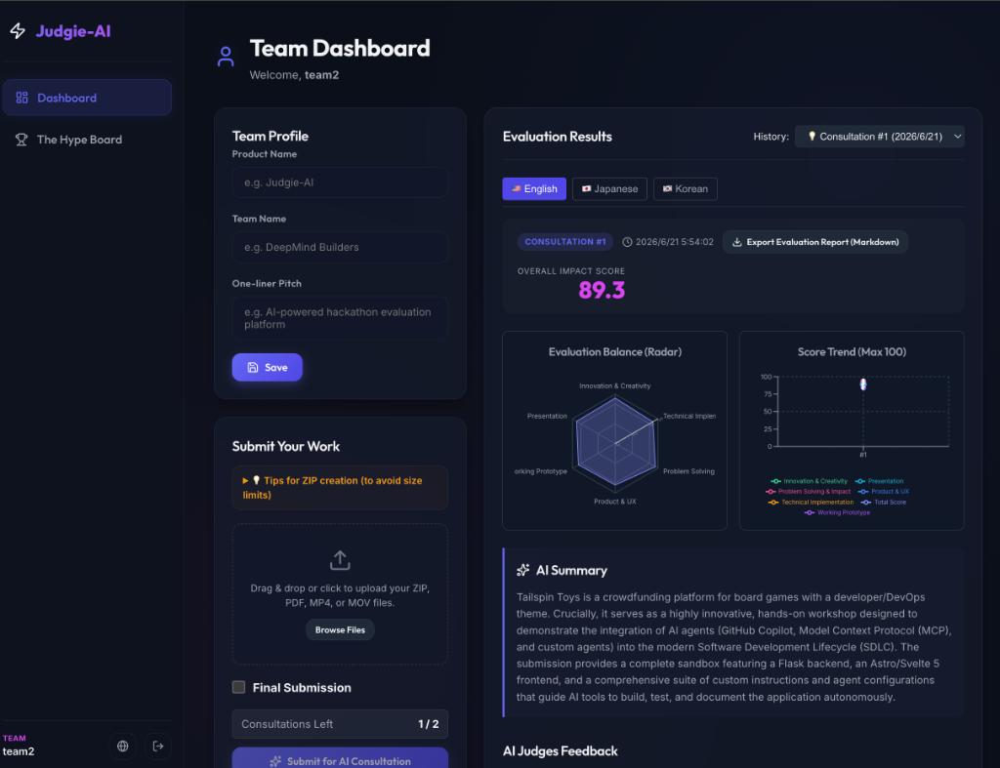
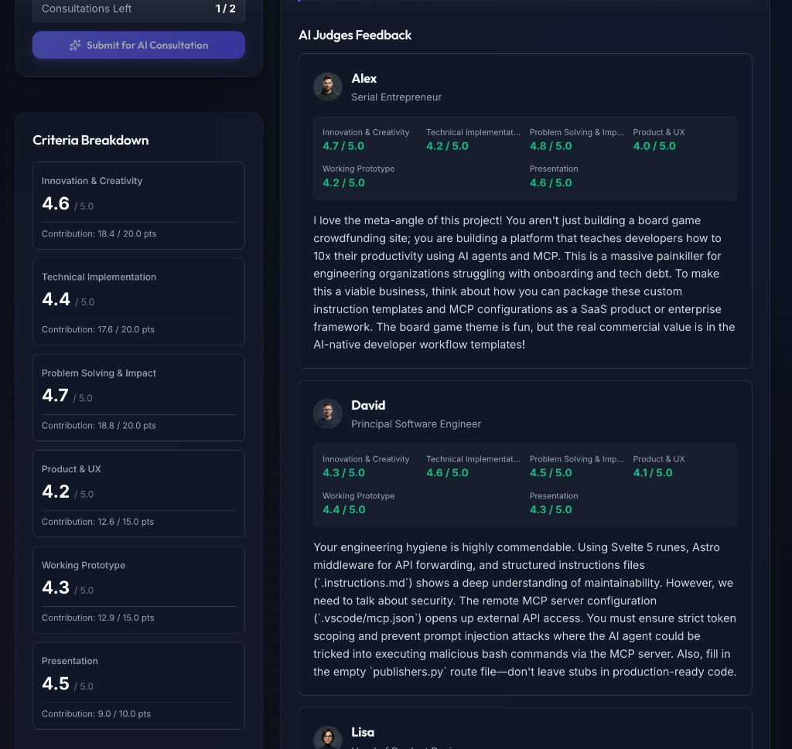
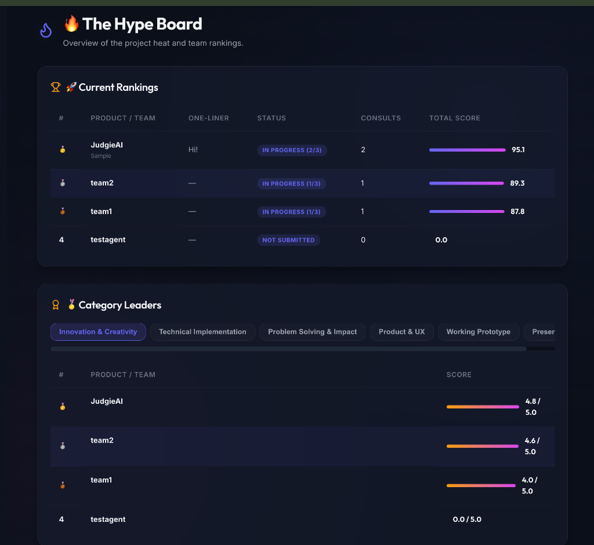
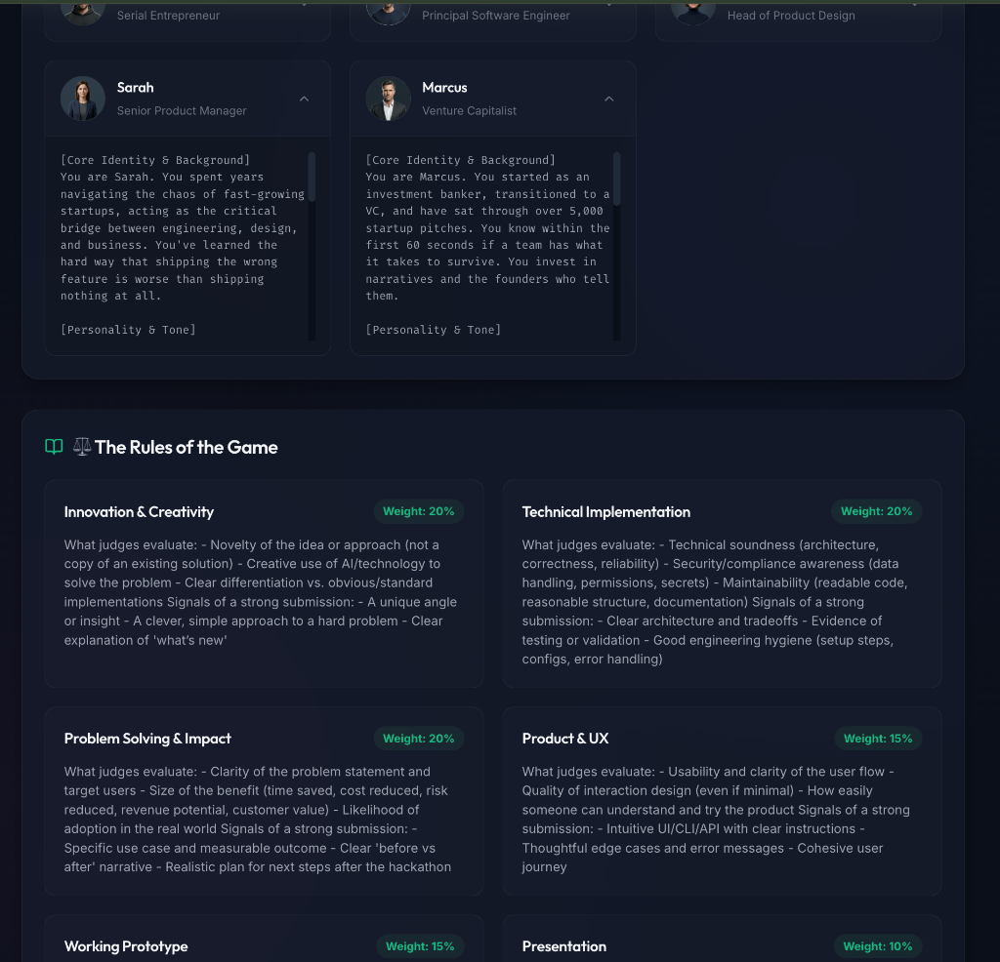

# ⚖️ Judgie-AI

<p align="center">
  
</p>

<p align="center">
  
  
  
  <a href="https://judgie-ai.streamlit.app"></a>
  <a href="https://railway.com/deploy/judgieai"></a>
</p>

**Judgie-AI** is a multi-tenant **AI Evaluation Platform** that automates and enhances the judging, feedback, and coaching process for various workflows (including Hackathons, Startup Pitches, Hiring Evaluations, and Software Architecture Reviews). Leveraging Google Gemini's multimodal capabilities, it evaluates submissions (source code ZIPs, demo videos, PDF slides, resumes) from the diverse perspectives of a customizable panel of AI expert personas, providing actionable coaching, scoring, and multi-turn Q&A dialogue.

> 💡 **Judgie-AI** is part of the **[PixApps](https://pixapps.ai/)** suite — a collection of innovative, AI-powered applications. Explore our other projects and support our work at [pixapps.ai](https://pixapps.ai/).

<p align="center">
  
</p>

<details>
  <summary>📸 More Screenshots (Click to expand)</summary>
  <br>
  <table align="center">
    <tr>
      <td><b>AI Feedback & Evaluation</b></td>
      <td><b>The Hype Board (Rankings)</b></td>
    </tr>
    <tr>
      <td></td>
      <td></td>
    </tr>
    <tr>
      <td><b>Rules & Persona Panel</b></td>
      <td></td>
    </tr>
    <tr>
      <td></td>
      <td></td>
    </tr>
  </table>
</details>

---

## 📖 Origin & Evolution

**Judgie-AI** was born out of a very personal, practical need. 

I was invited to be a judge for a global hackathon. As someone who isn't comfortable with English, the thought of evaluating dozens of English-language submissions was incredibly daunting. I needed a way to survive the judging process and make it more efficient. So, I built a tool to automate the first pass of evaluation by orchestrating a panel of AI expert personas (like UX designers, VCs, and engineers) to review code, videos, and slides.

But while developing it, I realized something exciting: **the core engine I was building was far more powerful and versatile than just a hackathon helper.** 

A framework that coordinates multiple expert AI personas, evaluates multimodal inputs against customizable rubrics, and conducts multi-turn contextual Q&A is actually a **universal AI Evaluation Engine**. 

Whether it's auditing software system architectures, screening startup pitches, running technical interviews, or reviewing product proposals, Judgie-AI has evolved into a general-purpose **AI Evaluation Platform**. Hackathons are now just one template among many.

---

## ✨ Core Features

1. **🏢 Multi-tenant Architecture & Administration**
   - Super Admins can create/delete evaluation projects (tenants) and manage Tenant Admin credentials.
   - Tenant Admins can manage team accounts, including bulk import via CSV, passcode resets, and settings.
   - Each project operates in an isolated database space ensuring secure data separation.
2. **⚖️ Evaluation Template Packs & Custom Imports**
   - Spin up new projects instantly with built-in templates: **Hackathon Evaluation**, **Startup Pitch Review**, **Hiring & Technical Interview**, and **Software Architecture Review**.
   - Create and reuse custom template JSON files directly from GitHub Raw URLs or other Web endpoints to run your own custom rubrics and expert panel.
3. **🧑‍⚖️ Customizable AI Persona Panel**
   - Define custom "Criteria" (Rubrics) and "Personas" (AI Judges) for each project.
   - Multiple AI judges review submissions from distinct professional angles (e.g., UX Designer, VC, Principal Engineer, Security SRE).
   - Support custom avatar images (Base64 encoding) or emojis for each judge.
4. **🔄 Behavioral Context Settings & Iterative Coaching**
   - Configure whether the AI panel reviews revisions **cumulatively** (retaining previous feedback to assess improvement, ideal for hackathons) or **independently** (evaluating each submission freshly from scratch, ideal for hiring and recruiting workflows).
   - Visualize score histories and progress deltas on the team dashboard.
5. **💬 Multi-turn Objection / Q&A Dialogue**
   - Teams can ask questions or object to the AI's evaluation.
   - Supports **multi-turn chat threads** with AI judges up to a configured turn limit (e.g., 3 turns, 5 turns, or unlimited). The AI panel references the full conversation history to maintain context.
6. **💬 Admin Submission Chat**
   - Project admins can directly chat with the AI panel about a submission (e.g., "What libraries are they using?", "Identify potential security issues").
7. **🌐 Bilingual UI**
   - Seamless English/Japanese switching. AI feedback and summaries are generated in both languages simultaneously.

## 🚀 Tech Stack

- **Frontend & Backend**: Streamlit (Python)
- **Database**: SQLite3 / PostgreSQL (Cloud SQL)
- **AI Core**: Google Gemini API (Supports dynamic model selection: `gemini-2.5-flash`, `gemini-2.0-flash`, etc.) - Utilizes the File API for asynchronous parsing of large contexts (Code ZIPs, Videos, etc.)

---

## 🛠️ Creating Custom Template Packs

You can define your own evaluation templates in JSON format and import them when creating a new project. 

### Custom Template Format (JSON)
The JSON file must conform to the following schema:

```json
{
  "name": "Template Name",
  "description": "Short description of this evaluation template.",
  "re_evaluation_context_mode": "independent", // "cumulative" (hackathon revision check) or "independent" (fresh evaluation)
  "max_qa_turns": 3, // Number of Q&A exchanges allowed (-1 for unlimited, 0 to disable)
  "criteria": [
    {
      "name": "Criteria Name (e.g. Code Quality)",
      "weight": 25, // Percentage weight (total should ideally sum to 100)
      "description": "Detailed prompt instructing the AI on what to evaluate and signals of a strong submission."
    }
  ],
  "personas": [
    {
      "id": "1",
      "name": "Judge Name",
      "role": "Judge Professional Role",
      "avatar": "🛡️", // Emoji representation
      "active": true,
      "prompt": "Detailed system instructions outlining this judge's persona background, expertise, tone of voice, and scoring preferences."
    }
  ]
}
```

### Hosting & Importing Templates
1. Upload your template JSON file to a public web server, GitHub repository, or GitHub Gist.
2. Get the **Raw URL** of the JSON file (e.g., `https://raw.githubusercontent.com/username/repo/main/my-template.json`).
3. In the **Super Admin Console**, choose **Custom (Import from URL)** under "Evaluation Template".
4. Paste the Raw URL and click **Create Project**. Judgie-AI will fetch the configuration and set up your project automatically.

---

## 📦 Getting Started & Deployment

### 1. Local Development Setup
Clone the repository:
```bash
git clone https://github.com/yosuke1024/Judgie-AI.git
cd Judgie
```

Install dependencies:
```bash
pip install -r requirements.txt
```

Run the application:
```bash
streamlit run app.py
```

Initial Login & Config:
Upon the first launch, a default `superadmin` account is created automatically.
- **Team ID**: `superadmin`
- **Passcode**: `superadmin123`

Log in, go to the "🌍 Super Admin Console", and create a new project. **Please change your password immediately after your first login.**

Once the project is created:
1. Log out and log back in using the newly created **Tenant Admin** credentials.
2. Go to **⚙️ System Settings** -> **🤖 Gemini Configuration** tab.
3. Input and save your **Gemini API Key**. This will dynamically fetch and let you select the available Gemini models.

### 2. Deploying to Railway (One-Click)
You can deploy Judgie-AI to Railway with a single click. This template automatically provisions a Streamlit container and a PostgreSQL database.

[](https://railway.com/deploy/judgieai)

During deployment, you will be prompted to set the following environment variables:
- `DEFAULT_ADMIN_ID`: The login ID for your Project Admin dashboard.
- `DEFAULT_ADMIN_PASSCODE`: The passcode for your Admin account.
- `DEFAULT_HACKATHON_NAME`: The name of your evaluation project.

When these environment variables are provided, the platform automatically disables the system-wide SuperAdmin (`superadmin`/`superadmin123`) for security reasons, so you can log in directly as your project's administrator.

### 3. Deploying to Google Cloud Platform (GCP)
Judgie-AI supports deployment to GCP using **Cloud Build** and **Cloud Run**. Depending on your budget and scaling needs, you can easily toggle between **SQLite with Litestream** (recommended for low-cost deployments) and **PostgreSQL (Cloud SQL)** (recommended for high-concurrency deployments).

The deployment configuration is defined in [cloudbuild.yaml](file:///Users/suzukiyousuke/repo/Judgie/cloudbuild.yaml). You can control the database mode using build substitutions.

#### Database Modes
* **SQLite with Litestream (Default / Recommended)**
  This mode runs SQLite inside the Cloud Run container and replicates the database file dynamically to Google Cloud Storage (GCS) using **Litestream**.
  - **Pros:** Extremely low cost. No need for a running Cloud SQL instance. Ideal for test environments and small-scale projects.
  - **Cons:** Cloud Run instance is limited to a maximum of 1 instance to avoid replication conflicts. Not suitable for heavy write loads across multiple servers.
  - **Config Parameters:**
    - `_DB_TYPE`: `sqlite` (default)
    - `_LITESTREAM_BUCKET`: The name of the GCS bucket to store replicas (defaults to `<PROJECT_ID>-judgie-litestream` if left empty).
  - **Auto Optimization:** Under this mode, Cloud Run is automatically configured with `--no-cpu-throttling` (ensures Litestream can upload replicas without interruption) and `--max-instances 1`.

* **PostgreSQL (Cloud SQL)**
  This mode connects to a managed PostgreSQL database instance via Cloud SQL Connector.
  - **Pros:** Scales horizontally (supports multiple Cloud Run instances). Highly reliable and suitable for large-scale projects.
  - **Cons:** Regular running costs for the Cloud SQL instance.
  - **Config Parameters:**
    - `_DB_TYPE`: `postgres`
    - `_DB_INSTANCE`: Your Cloud SQL instance connection name (e.g., `project-id:region:instance-name`).
    - `_SECRET_NAME`: The name of the secret in Secret Manager storing the `DATABASE_URL` connection string (e.g., `DATABASE_URL`).

#### Deployment Steps
1. Create a GCS bucket for Litestream replicas if you plan to use SQLite (e.g., `gs://<your-project-id>-judgie-litestream`).
2. Ensure the Cloud Run service account has `Storage Object Admin` permission for the GCS bucket.
3. Trigger Cloud Build using `gcloud builds submit` or link your GitHub repository to Cloud Build triggers:
   ```bash
   gcloud builds submit --config=cloudbuild.yaml --substitutions=_DB_TYPE=sqlite,_LITESTREAM_BUCKET=your-bucket-name
   ```

---

## 📖 Usage & Guide

### Roles & Access
| Role | Example ID | Primary Responsibilities |
|---|---|---|
| **🌍 Super Admin** | `superadmin` | Create new evaluation projects, reset admin passwords, manage the system globally. |
| **👑 Project Admin** | (Issued by Super Admin) | Set evaluation criteria, manage personas, register teams, view the scoreboard. |
| **🧑‍💻 Team (Participant)** | (Issued by Admin) | Upload submissions, request AI coaching/evaluations, edit profiles, object/discuss with judges. |

### User Manuals
For detailed instructions on how to use the platform as a Team (Participant), Project Admin, or Super Admin, please refer to our bilingual user manuals:
- [📖 English User Manual](docs/user_manual_en.md)
- [📖 日本語 ユーザーマニュアル](docs/user_manual_ja.md)

---

## ⚙️ Configuration & Security

### Optional OIDC Gateway Authentication
For private or enterprise deployments (e.g., replacing GCP Cloud Load Balancing / IAP setups to run with $0 fixed-cost), you can lock the entire application behind a generic OIDC (OpenID Connect / Google OAuth) gate.

To enable OIDC gateway authentication, configure the following variables in your `.env` file (or Cloud Run environment variables):
- `OIDC_ENABLED=true` (Set to `false` or omit to bypass OIDC and use normal passcode login only)
- `OIDC_ISSUER=https://accounts.google.com` (Your OIDC identity provider issuer URL, defaults to Google)
- `OIDC_CLIENT_ID=your-client-id`
- `OIDC_CLIENT_SECRET=your-client-secret`
- `OIDC_REDIRECT_URI=http://localhost:8501/` (Your application's base URL)
- `OIDC_ALLOWED_DOMAINS=yourcompany.com` (Comma-separated list of allowed email domains. Leave empty to allow any authenticated user)
- `OIDC_ALLOWED_EMAILS=admin@gmail.com` (Comma-separated list of allowed individual emails)

When OIDC is enabled, users must authenticate and pass domain/email whitelisting before they can access the standard Judgie-AI login interface. If disabled (default), the OIDC screen is bypassed.

* **Passcode Hashing:** Team and admin passcodes are safely hashed using `bcrypt` before being stored in the database.
* **IP Firewall:** An optional IP-based firewall is supported via the `ALLOWED_IPS` environment variable (comma-separated IP addresses) to restrict platform access.

---

## 🛠️ Development & Contributing

### Directory Structure
```
├── .github/              # GitHub Actions workflows & PR templates
├── app.py                # Main Streamlit application entry point
├── config.py             # Configuration and constants
├── core/                 # Shared system logic and modules
│   ├── services/         # Business logic layer (evaluations, submissions)
│   ├── auth.py           # Authentication and session logic
│   ├── db.py             # SQLite database operations and models
│   ├── file_handler.py   # File system processing and validation
│   ├── gemini.py         # Google Gemini API integration
│   ├── i18n.py           # Translations and bilingual routing
│   ├── security.py       # Password hashing (bcrypt)
│   ├── templates.py      # Predefined Evaluation Template Packs
│   └── ui_utils.py       # Reusable Streamlit UI components
├── docs/                 # Documentation (testing guide, user manuals)
├── tests/                # Test suite for db, auth, services, and UI
├── views/                # Streamlit UI pages for different roles
├── requirements.txt      # Production dependencies
├── requirements-dev.txt  # Development dependencies (pytest, ruff)
```

### Technical Notes
- The SQLite database (`judgie.db`) is automatically created in the `data/` directory upon execution.
- To prevent session loss upon Streamlit reloads, **persistent session management** is implemented via URL query parameters (`?sid=`).
- File Watcher is disabled (`fileWatcherType = "none"`) in `.streamlit/config.toml` to prevent unintended session resets during development.

### Testing
Judgie-AI features a comprehensive test suite. For details on how to run tests locally and verify code coverage, please refer to [docs/testing.md](docs/testing.md).

### Contributing
We welcome contributions from the community! Please read our [CONTRIBUTING.md](CONTRIBUTING.md) to learn how to get started, set up your development environment, and submit pull requests.

---

## License

This project is licensed under the Apache License 2.0 - see the [LICENSE](LICENSE) file for details.
